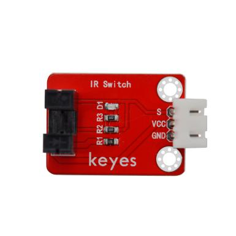
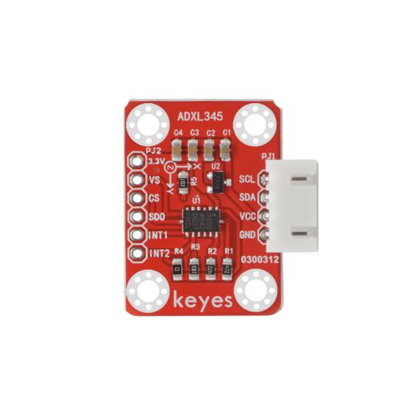
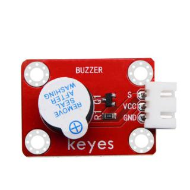
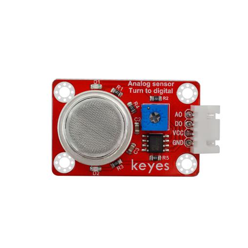
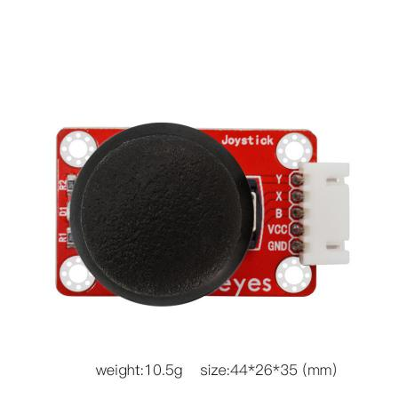
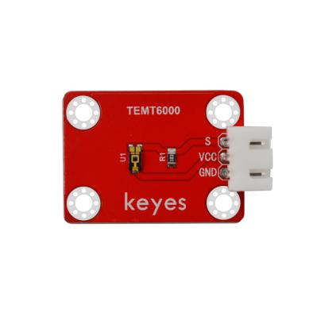

# 清单

|编码|名称|规格型号|数量|图片|
|-|-|-|-|-|
|1|Keyes模块|keyes brick LED白发白模块(焊盘孔) 防反插白色端子|1||
|2|Keyes传感器|keyes brick 热敏电阻传感器(焊盘孔) 防反插白色端子|1||
|3|Keyes传感器|keyes brick 按键传感器(焊盘孔) 防反插白色端子（配黄帽）|1||
|4|Keyes模块|keyes brick 干簧管(焊盘孔) 防反插白色端子|1||
|5|Keyes传感器|keyes brick 魔术光杯传感器(焊盘孔) 防反插白色端子|2||
|6|Keyes传感器|keyes brick DHT11温湿度传感器(焊盘孔) 防反插白色端子|1||
|7|Keyes模块|keyes brick 双色LED模块(焊盘孔) 防反插白色端子|1||
|8|Keyes传感器|keyes brick 光敏电阻传感器(焊盘孔) 防反插白色端子|1||
|9|Keyes传感器|keyes brick 倾斜模块传感器(焊盘孔) 防反插白色端子|1||
|10|Keyes传感器|keyes brick 光折断传感器(焊盘孔) 防反插白色端子|1||
|11|Keyes模块|keyes brick 手指测心跳模块(焊盘孔) 防反插白色端子|1||
|12|Keyes传感器|keyes brick ADXL345加速度传感器(焊盘孔) 防反插白色端子|1||
|13|Keyes模块|keyes brick 贴片RGB模块(焊盘孔) 防反插白色端子|1||
|14|Keyes传感器|keyes brick 麦克风声音传感器(焊盘孔) 防反插白色端子|1||
|15|Keyes传感器|keyes brick 霍尔传感器(焊盘孔) 防反插白色端子|1||
|16|Keyes传感器|keyes brick 碰撞传感器(焊盘孔) 防反插白色端子|1||
|17|Keyes传感器|keyes brick 红外发射传感器(焊盘孔) 防反插白色端子|1||
|18|Keyes传感器|keyes brick HC-SR04超声波传感器 防反插白色端子|1||
|19|Keyes模块|keyes brick 有源蜂鸣器模块焊盘孔) 防反插白色端子|1||
|20|Keyes传感器|keyes brick MQ-2 烟雾传感器(焊盘孔) 防反插白色端子|1||
|21|Keyes传感器|keyes brick 敲击模块传感器(焊盘孔) 防反插白色端子|1||
|22|Keyes传感器|keyes brick 电容触摸传感器(焊盘孔) 防反插白色端子|1||
|23|Keyes传感器|keyes brick 红外接收传感器(焊盘孔) 防反插白色端子|1||
|24|Keyes传感器|keyes brick 摇杆模块传感器(焊盘孔) 防反插白色端子（要配摇杆帽）|1||
|25|Keyes模块|keyes brick 无源蜂鸣器模块(焊盘孔) 防反插白色端子|1||
|26|Keyes传感器|keyes brick MQ-3 酒精传感器(焊盘孔) 防反插白色端子|1||
|27|Keyes传感器|keyes brick 避障传感器(焊盘孔) 防反插白色端子|1||
|28|Keyes传感器|keyes brick LM35温度传感器(焊盘孔) 防反插白色端子|1||
|29|Keyes模块|keyes brick 旋转编码器模块(焊盘孔) 防反插白色端子|1||
|30|Keyes传感器|keyes brick 人体红外热释电传感器(焊盘孔) 防反插白色端子|1||
|31|Keyes模块|keyes brick 激光头传感器模块(焊盘孔) 防反插白色端子|1||
|32|Keyes模块|keyes brick 可调电位器模块(焊盘孔) 防反插白色端子|1||
|33|Keyes传感器|keyes brick 巡线传感器(焊盘孔) 防反插白色端子|1||
|34|Keyes传感器|keyes brick 18B20温度传感器(焊盘孔) 防反插白色端子|1||
|35|Keyes传感器|keyes brick TEMT6000光线传感器(焊盘孔) 防反插白色端子|1||
|36|Keyes模块|keyes brick 5V 单路继电器模块(焊盘孔) 防反插白色端子|1||
|37|Keyes模块|keyes brick 插件RGB模块(焊盘孔) 防反插白色端子|1||
|38|Keyes扩展板|Keyes brick shield 传感器扩展板 防反插白色端子|1||
|39|Keyes开发板|keyes UNO PLUS for arduino 开发板 红色 环保|1||
|40|连接线|3P 双头XH2.54插头 L=200mm 白色|15||
|41|连接线|4P 双头XH2.54插头 L=200mm 白色|8||
|42|连接线|5P 双头XH2.54插头 L=200mm 白色|3||
|43|USB线|USB2.0对TYPE C 白色 L:1M OD：4.0MM|1||

