# 米思奇

# keyes UNO R3

## 第1小节 简单介绍keyes UNO PLUS开发板

我们先看一下他的特写：

我们通过下面的图来了解一下这个开发板的各个接口和主要元器件。

接口简介

串口通信接口：D0为RX、D1为TX

PWM接口（脉宽调制）：D3 D5 D6 D9 D10 D11

外部中断接口：D2(中断0)和D3 (中断1)

SPI通信接口：D10为SS、D11为MOSI、D12为MISO、D13为SCK

IIC通信端口：A4为SDA、A5为SCL

时钟频率

主板使用16 MHz晶振

## 第2小节 了解米思奇

上一节我们了解了keyes UNO PLUS开发板的驱动安装方法，这节课我们开始学习米思奇图形化编程软件

1.Mixly简介

Mixly是一款由北京师范大学教育学部创客教育实验室傅骞教授团队基于Google的Blockly图形化编程框架开发的免费开源的图形化Arduino编程软件。是一款面向创意电子开发的免费开源图形化编程工具；一个面向创意电子教育的完整支持生态；一个创客教育工作者实现梦想的舞台。

可以说Mixly是目前功能最丰富，操作最流畅的Arduino图形化编程软件，几乎可以替代Arduino IDE编程工具。

米思齐软件下载地址

<http://mixly.org/explore/software/mixly-arduino>

2.Mixly的设计理念及适合人群

2.1设计理念

（1）易用性

Mixly在设计上做到了完全绿色使用。目前Mixly支持win、ubuntu、mac。Windows用户直接从网上下载Mixly软件包，解压后即可在Windows XP及以上版本的操作系统运行（下文附有下载链接）。

（2）简单性

Mixly采用了Blockly图形化编程引擎，使用图形化的积木块代替了复杂的文本操作，为初学者的快速入门奠定了良好的基础。①用不同颜色的示意图标代表不同类型的功能块，方便用户归类区分。②在复合功能块中提供默认选项，有效减少用户的拖动次数。③在同一个界面整合软件的所有功能。④提供参考教程及代码示例。 

（3）功能性

功能多样，arduino IDE能实现的功能和函数，Mixly也几乎都可以实现。支持arduino所有的官方开发板。

（4）延续性

图形化编程系统的目标绝对不是替换原有的文本编程方式，而是希望通过图形化编程更好更快地理解编程的原理和程序的思维，并为未来的文本编程打好基础。Mixly的设计理念也是如此。在软件的设计上加入了更多的可延续性内容，从而保护了用户的学习成果。具体来说，包括引入变量类型、在模块的设计上尽量保持和文本编程的一致、支持图形编程和文本编程的对照等。 

（5）生态性 

生态性是Mixly最重要的设计理念，也是它区别于其他Arduino图形化编程的最重要特征。为了实现可持续发展，Mixly在设计上既允许厂商开发自己的特有模块，用户需要有JavaScript编程基础才能制作这部分模块，也允许用户直接利用Mixly的图形化编程功能生成通用模块（如数码管显示、蜂鸣音播报等，用户只需会使用Mixly即可制作这部分模块）。以上两类模块均可通过“导入库”功能导入Mixly系统，从而在Mixly软件的普及中实现用户自身的价值。

2.2合适人群

从以上的设计理念，可以看出，Mixly适合中小学生来学习编程思维。也适合创客制作作品时能快速编程。当然更适合一些不想学文本编程，却想做一些智能控制小作品的大朋友们。

3.Mixly界面功能介绍

3.1 Mixly系统功能简介

Mixly的主界面由左上的模块选择区、中上的程序构建区、右上的代码程序区（可隐藏）、中部的系统功能区和下部的消息提示区构成。

如下图所示：

界面一些常用的功能：通过该界面，用户可以完成程序的编写、上传、保存、代码查看等全部工作。支持程序块向左拖出编程窗、拖拽至垃圾桶、delete键及右键delete四种删除方式；软件支持4种语言：English、Español、中文简体、中文繁体
。

3.2 IO功能模块：主板是keyes UNO R3开发板

3.3 控制模块

3.4 数学模块

3.5文本模块

3.6 List模块

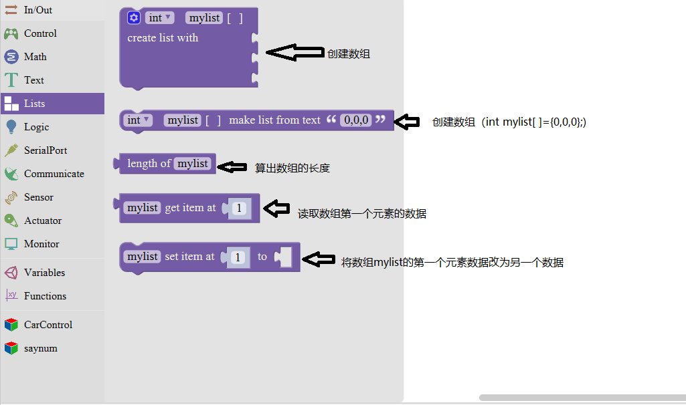

3.7 Logic模块

3.8 Variable模块

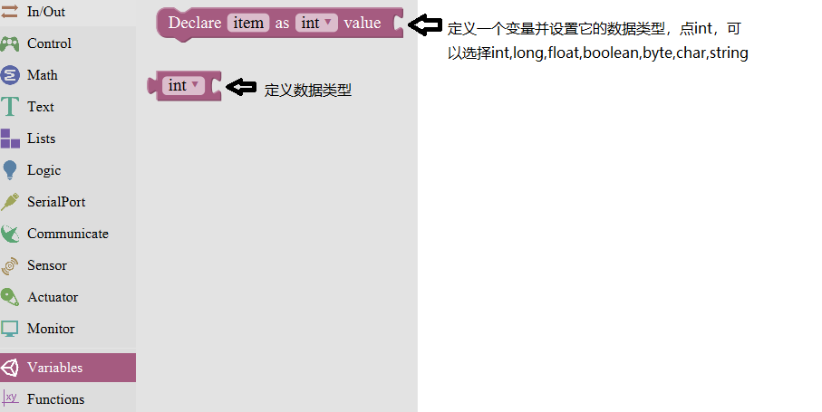

3.9 SerialPort模块

3.10 Communicate模块

3.11 Sensor模块

3.12 Actuator模块

3.13 Monitor模块

3.14 Function模块

## 第3小节 米思奇库文件添加

为了方便小车程序制作，我们特别为这款小车制作了一个小车库文件。库文件的导入，导出和编辑如下图所示。

点击导入库，进入库文件（文件夹），点击文件，库文件

就导入成功。

## 第4小节 keyes UNO PLUS开发板的驱动安装方法

我们开始为Keyes Uno Plus 开发板安装驱动。Keyes Uno Plus
开发板的USB转串口 芯片用的是著名的CP2102
芯片，在米思奇软件安装目录下的“arduino”--\>“drivers”
文件夹下已经包含了这个芯片的驱动程序，这样我们使用起来会非常方便。一般插
上USB，电脑就会识别到硬件，WINDOWS就会自动安装CP2102的驱动。

如果驱动安装不成功，或者你想手动安装驱动，请打开电脑的设备管理器

显示CP2102的驱动没有安装成功，有一个黄色的感叹号。我们双击硬件更新驱动

浏览计算机查找驱动程序，先找到米思奇软件安装目录下的“arduino”--\>“drivers”文件夹，

打开文件夹就能看到CP210X系列芯片的驱动，

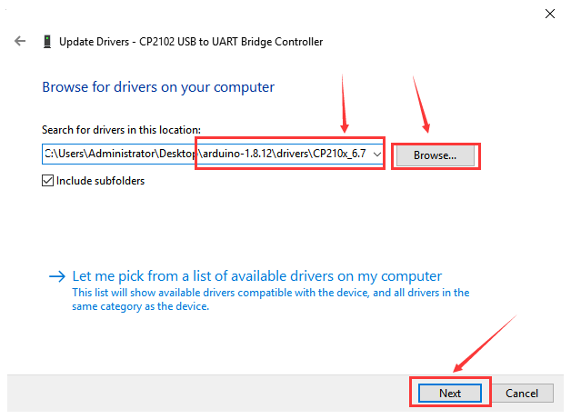

我们选择这个文件夹，然后点击确定，驱动安装成功。

这个时候再打开设备管理器，我就可以看到CP2102的驱动程序已经安装成功了，刚刚的那个黄色的感叹号不见了。

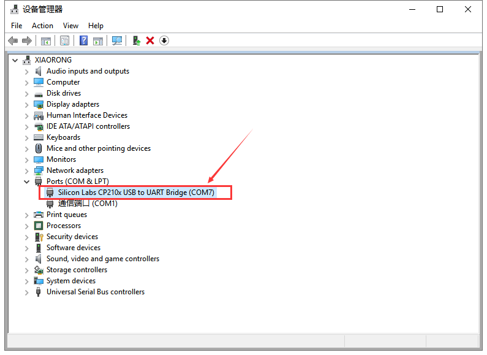

# 模块实验课程

拿到套件后，我们可以看到套件中有37款传感器/模块，有对应的keyes UNO PLUS

开发板、传感器扩展板和连接线。这里，我们将37款传感器/模块利用自带连接线，单独连接在keyes UNO PLUS开发板和传感器扩展板。然后上传对应的测试代码，单独测试各个传感器/模块的功能。

特别注意：实验时，模块/传感器连接线材时，必须按照资料里的接线方法及位置，电源与信息脚不能错接，否则会损坏模块/传感器。

## 实验一 LED 模块测试

实验说明

在这个套件中，我们有一个keyes brick LED白发白模块。它的控制方法非常简单，控制时，GND VCC上电后；信号端S为高电平时LED亮起，S为低电平时LED熄灭。

实验中，我们提供两个测试代码，分别控制LED模块上实现闪烁和呼吸灯的效果。闪烁效果好理解；呼吸灯效果，就是控制LED模块上LED首先逐渐变亮，然后逐渐变暗，循环交替，如人体呼吸一样。

实验器材

keyes brick LED白发白模块*1

keyes UNO PLUS开发板*1

传感器扩展板*1

3P 双头XH2.54连接线*1

USB线*1

接线图

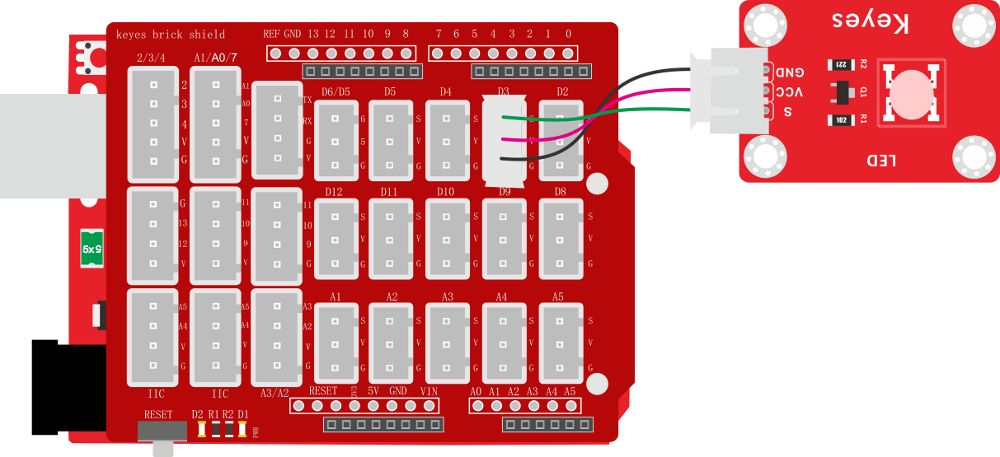

测试代码

代码1：

代码2：

代码说明

代码1说明：

1.  代码1中我们从库文件中

    找到。

2.  中，管脚是指模块信号端连接的接口，通过接线图，我们方向模块信号端连接在D3，因此，代码中我们把管脚设置为3。是指，我们可以将模块信号端S设置为高低电平。我们测试的过程中，当模块S端设为高电平（高）时，模块上LED亮起，设为低电平（低）时，模块上LED熄灭。

3.  代码中代码延迟时间，单位毫秒，代表延迟1000毫秒，即1秒。

4.  在米思齐软件中，只要没有单元，就代表代码中所有设置都是循环的。

5.  通过整合前面知识。我们再来看代码就清楚明了了，代码中第一条我们把模块信号端接到D3，设置为高电平，就是点亮模块上LED；第二条延迟1000毫秒，就是让模块上LED点亮1秒。同样第三条第四条代码表示让模块上LED熄灭1秒。代码默认循环，也就是控制模块上LED，循环亮1秒，灭1秒，实现闪烁效果。通过代码设置，我们可以更改模块上LED亮灭的延迟时间，从而使模块上LED实现不同的闪烁效果。

    **代码2说明：**

1.  代码中，用到了单元，代码改单元中的代码设置
    只执行1次，然后后面的代码就一直是循环的了。

2.  代码1中，我们控制模块上信号端控制LED亮灭。在代码2中，我们通过利用keyes     UNO     R3开发板上PWM口，设置PWM值，控制模块上LED亮度。只有PWM口的原理，这里就不多介绍了，网上有很多信息。

3.  keyes UNO R3开发板上只有D3 D5 D6 D9 D10     D11数字口是PWM口，也就是说如果要控制LED的亮度，信号端就只能接着几个接口。实验中，我们将模块信号端接在D3脚，属于PWM口。设置时我们设置PWM数值越小，模块上LED越暗，数值越大，模块上LED越亮，范围为0-255。

4.  ，初始化时，我们将D3的PWM数值设置为0，即熄灭模块上的LED。

5.  代表设置一个变量i，i从0直接增加到255，每一次都加1，总共加了255次。

6.  代表将D3的PWM值设置为i，代表延迟10毫秒；和前面代码搭配，代表每过10毫秒，变量i都加1，直到i为255。

7.  代表设置一个变量i，i从255直接减小到0，每一次都加-1，总共加了255次。

8.  通过整合前面知识，我们再来看代码，就清楚多了。初始时我们将D3端设置为0，熄灭模块上LED。然后开始循环，将D3的PWM值设置为i，i刚开始由0增加到255，每次加1，每加一次延迟10毫秒，模块上LED逐渐变亮。PWM为255后，i开始由255减小到0，每次减1，每减一次延迟10毫秒，模块上LED逐渐变暗。然后又逐渐变亮，循环交替，如人体呼吸一样。

9.  如果我们感觉逐渐变亮
    或者逐渐变暗的时间过长，我们可以更改代码设置。有两种方法，一种是将每次加1减1的延迟时间降低；另一种是更改步长，注意这个步长必须能被255整除，如3     5。步长改为3 -3代表i每次增加3或减小3。

测试结果

上传测试代码1成功，上电后，LED模块上LED开始闪烁，亮1秒，灭1秒，循环交替。上传测试代码2成功，上电后，LED模块上LED开始逐渐变亮，然后开始逐渐变暗，循坏交替，如人体呼吸一样。

## 实验二 双色LED模块调节LED颜色

实验说明

在这个套件中，有一个keyes brick
双色LED模块，它采用F5-红绿共阴雾状LED元件。控制时，我们需要将模块R G连接单片机PWM口，GND接地线。我们通过调节两个PWM值，控制LED元件显示红光、绿光的比例，从而控制双色LED显示不同颜色。

实验中，我们通过2个测试代码，两种控制方法，控制它显示不同颜色。

实验器材

keyes brick 双色LED模块*1

keyes UNO PLUS开发板*1

传感器扩展板*1

3P 双头XH2.54连接线*1

USB线*1

接线图

测试代码

代码1：

代码2：

代码说明

代码1说明：

1.  代码1中，我们从库文件中找到

    ，我们把管脚设置为5和6。
    管脚5对应的是数字口5，用于控制双色LED显示绿色；
    管脚6对应的是数字口6，用于控制双色LED显示红色。模块是共阴驱动，即对应颜色设置为高电平时，对应颜色LED亮起。

2.  现在观察代码，这个代码非常简单，只是简单的控制模块上
    LED显示绿色1秒、

    红色1秒、混合颜色（红绿比例一样）1秒，循环交替。

    **代码2说明：**

1.  初始化 时设置D5 D6的PWM值为0，熄灭模块上双色 LED。

2.  开始设置一个子程序，找到函数选项，找到项，选择使用该单元。

    点击标志设置子程序框架，将拉入，连续拉入2个该单元；点击设置3个参数类型，我们都设置为整数，点击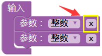设置参数名称；子程序框架设置成功，显示

    ，点击标志，退出子程序框架设置。设置完后，我们可以在单元中，找到设置的2个名称的参数。

3.  设置框架成功后，显示，点击，设置子程序名称，我们设置为color。

4.  子程序框架名称设置成功后，我们就开始设置子程序。根据接线，我们D6控制双色
    LED显示红光，D5控制双色
    LED显示绿光。我们利用这2个PWM口的PWM值控制双色LED显示不同颜色。控制对应的PWM值越大，对应显示的颜色比例越重。因此，子程序我们设置为。

5.  子程序设置成功后，我们就可以在中找到，这里我们通过设置这2个参数，控制模块上双色ED显示不同颜色、亮度，理论来说，可以设置双色LED显示多种颜色，总共有255\*255种排列组合。

6.  设置时，如表示使双色
    LED显示最亮的红色。

    表示使双色
    LED显示混合颜色，颜色比例为红：绿为128:255。

测试结果

上传测试代码1成功，上电后，模块上双色LED循环显示对应设置的3种颜色，间隔时间为1秒。上传测试代码2成功，上电后，模块上双色LED显示对应设置的3种颜色，循环不止，间隔时间为1秒。

## 实验三 插件RGB模块调节LED颜色

实验说明

在这个套件中，有一个插件RGB模块，它采用F5-全彩RGB雾状共阴LED元件。控制时，我们需要将模块R G
B连接单片机PWM口，-接GND。我们通过调节3个PWM值，控制LED元件显示红光、绿光和蓝光的比例，从而控制RGB模块上LED显示不同颜色灯光。当设置的PWM值越大，对应显示的颜色比例越重。理论来说，通过调节这3中颜色光的混合比例，可以模拟出所有颜色的灯光。

实验中，我们通过测试代码，控制模块上RGB LED显示几个常用颜色。

实验器材

keyes brick 插件RGB模块*1

keyes UNO PLUS开发板*1

传感器扩展板*1

4P 双头XH2.54连接线*1

USB线*1

接线图

测试代码

代码1：

代码2：

代码说明

代码1说明：

1.代码1中，我们从库文件中找到

，其中R G B代表控制

模块上 LED对应的红绿蓝3种颜色对应的端口，根据接线图我们接到了D9 D10 D11，设置为9 10 11，后面设置对应高低，设置GRB LED中红绿蓝3个灯是否会亮，设置为高（对应数字口为高电平），对应的颜色就亮。

2.现在观察代码，这个代码非常简单，只是简单的控制模块上RGB LED显示红色1秒、

绿色1秒、蓝色1秒，循环交替。

代码2说明：

1.代码1中，我们从库文件中找到

，其中R G B

代表控制RGB LED对应的红绿蓝3种颜色对应的端口，根据接线图我们接到了D9 D10

D11，设置为9 10 11。后面设置数据代表设置模块上LED
红绿蓝颜色的比例，设置的

数据越大（对应的PWM值越大），设置该颜色的比例越大。

2.实验中我们通过设置对应数值，调节RGB LED上红绿蓝颜色比例，从而控制RGB LED显示对应颜色。

测试结果

上传测试代码1成功，上电后，模块上RGB LED循环显示红绿蓝3种颜色，间隔时间为1秒。上传测试代码2成功，上电后，模块上RGB LED显示红绿蓝黄紫白6种颜色，然后熄灭，循环不止，间隔时间为1秒。

## 实验四 贴片RGB模块调节LED颜色

实验说明

在这个套件中，有一个贴片RGB模块，它采用5050 RGB
高亮LED元件。控制时，我们需要将模块R G B连接单片机PWM口，+接5V。我们通过调节3个PWM值，控制LED元件显示红光、绿光和蓝光的比例，从而控制RGB模块上LED显示不同颜色灯光。当设置的PWM值越大，对应显示的颜色比例越低。理论来说，通过调节这3中颜色光的混合比例，可以模拟出所有颜色的灯光。

实验中，我们通过测试代码，控制模块上RGB LED显示几个常用颜色。

实验器材

keyes brick 贴片RGB模块*1

keyes UNO PLUS开发板*1

传感器扩展板*1

3P 双头XH2.54连接线*1

USB线*1

接线图

测试代码

代码1：

代码2：

代码说明

代码1说明：

1.代码1中，我们从库文件中找到

，其中R G B代表控制

模块上 LED对应的红绿蓝3种颜色对应的端口，根据接线图我们接到了D9 D10 D11，设置为9 10 11，后面设置对应高低，设置GRB LED中红绿蓝3个灯是否会亮，设置为高（对应数字口为低电平），对应的颜色就亮。

2.现在观察代码，这个代码非常简单，只是简单的控制模块上RGB LED显示红色1秒、

绿色1秒、蓝色1秒，循环交替。

代码2说明：

1.代码1中，我们从库文件中找到

，其中R G B

代表控制RGB LED对应的红绿蓝3种颜色对应的端口，根据接线图我们接到了D9 D10

D11，设置为9 10 11。后面设置数据代表设置模块上LED
红绿蓝颜色的比例，设置的

数据越大（对应的PWM值越小），设置该颜色的比例越大。

2.实验中我们通过设置对应数值，调节RGB LED上红绿蓝颜色比例，从而控制RGB LED显示对应颜色。

测试结果

上传测试代码1成功，上电后，模块上RGB LED循环显示红绿蓝3种颜色，间隔时间为1秒。上传测试代码2成功，上电后，模块上RGB LED显示红绿蓝黄紫白6种颜色，然后熄灭，循环不止，间隔时间为1秒。

## 实验五 激光头传感器模块发出激光

实验说明

在这个套件中，包含一个激光头传感器模块。它主要由1个铜材半导体激光管元件组成。控制时，我们需要在模块S端输入高电平信号，模块开始工作，激光管发射出红色激光信号。

实验中，我们只是控制这个模块上激光管循环发射红色激光信号。

实验器材

keyes brick 激光头传感器模块*1

keyes UNO PLUS开发板*1

传感器扩展板*1

3P双头XH2.54连接线*1

USB线*1

接线图

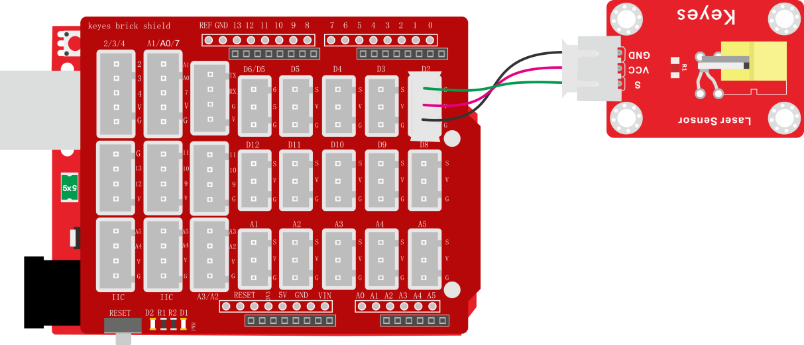

测试代码

代码说明

1\.
在实验中，我们需要在库文件的单元内，找到以下元件。

2\.
我们把管脚设置为2，设置为高时，模块上激光管发射出红色激光信号；设置为低时，模块上激光管不发射出红色激光信号。

测试结果

上传测试代码成功，上电后，模块上激光管发射红色激光信号1秒，停止发射红色激光信号1秒，循环交替。

## 实验六 控制继电器开关

实验说明

在这个套件中，包含一个5V 单路继电器模块。它主要采用HK4100F-DC 5V-SHC继电器元件。继电器有3个绿色接线柱用于外接电路，分别为NO COM和NC端（背后丝印）。当继电器没有接控制信号时，COM端和NC端连通，COM端和NO端断开。

控制时，我们把GND接单片机GND，VCC接单片机5V,S接单片机数字口。当S信号端设置为高电平时，继电器开启，继电器COM端和NC端断开，COM端和NO端连通；S信号端设置为低电平时，继电器关闭，继电器COM端和NC端连通，COM端和NO端断开。

实验中，我们只是控制继电器NO端和COM端循环连接和断开。

实验器材

keyes brick 5V 单路继电器模块*1

keyes UNO PLUS开发板*1

传感器扩展板*1

3P双头XH2.54连接线*1

USB线*1

接线图

测试代码

代码说明

1\.
在实验中，我们需要在库文件的单元内，找到以下元件。

2\.
我们把管脚设置为3，设置为高时，继电器上NO端和COM端连接，NC端和COM端断开；设置为低时，继电器上NO端和COM端断开，NC端和COM端连接。

测试结果

上传测试代码成功，上电后，模块上NO端和COM端连接1秒，断开1秒，循环交替。

## 实验七 有源蜂鸣器模块播放声音

实验说明

在这个套件中，包含一个有源蜂鸣器模块，一个无源蜂鸣器模块。这个实验中，我们控制有源蜂鸣器发出声音。有源蜂鸣器元件内部自带震荡电路，控制时，我们只需要在蜂鸣器元件正极输入5V电源，负极接地，蜂鸣器就自动响起。在这个模块上我们在GND VCC输入5V电源；S信号端设置为高电平时，模块上蜂鸣器响起；设置为低电平时，模块上蜂鸣器没有声音。

实验中，我们只是控制这个模块上有源蜂鸣器的循环响起声音。

实验器材

keyes brick 有源蜂鸣器模块*1

keyes UNO PLUS开发板*1

传感器扩展板*1

3P双头XH2.54连接线*1

USB线*1

接线图

测试代码

代码说明

1\.
在实验中，我们需要在库文件的单元内，找到以下元件。

2\.
我们把管脚设置为3，设置为高时，模块上有源蜂鸣器响起；设置为低时，模块上有源蜂鸣器关闭声音。

测试结果

上传测试代码成功，上电后，模块上有源蜂鸣器响起1秒，关闭1秒，循环交替。

## 实验八 无源蜂鸣器模块播放音乐

实验说明

前面课程中我们介绍了套件中的有源蜂鸣器模块的使用方法。在这里我们介绍下套件中的无源蜂鸣器模块，它主要采用12\*8.5MM 5V 2K无源蜂鸣器元件。无源蜂鸣器元件内部不带震荡电路，控制时，我们只需要在蜂鸣器元件正极输入不同频率的方波（电压5V），负极接地，控制蜂鸣器响起不同频率的声音。该元件的中心频率是2KHz。无源蜂鸣器驱动频率与发生频率之间是一一对应的关系，即驱动频率是2KHz的方波，那听到的声音频率也是2KHz。

实验中，我们利用无源蜂鸣器模块上蜂鸣器输出各种频率的声音，然后控制无源蜂鸣器模块上蜂鸣器播放完整音乐。

实验器材

keyes brick 无源蜂鸣器模块*1

keyes UNO PLUS开发板*1

传感器扩展板*1

3P 双头XH2.54连接线*1

USB线*1

接线图

测试代码

代码1：

代码2：

代码说明

代码1说明：

1.  在的单元找到

    ，其中管脚是代码模块信号端接口，我们连接的是D3，所以设置为3；音调设置对应的是模块上无源蜂鸣器发出的频率，我们可以点击米思齐软件上代码按键，看到对应频率；节拍对应的是各个频率延迟的时间，1个节拍就是延迟1秒。

2.  同样，可以在的单元找到

    ，管脚我们同样设置为3，代码1中为了方便观察效果，我们在后面加了延迟500毫秒。

    **代码2说明：**

1.  同样，可以，在的单元找到

    ，管脚我们设置为3。我们库文件中，直接利用代码

    控制频率和节拍，使蜂鸣器直接播放《圣诞歌》和《生日快乐》歌曲。

测试结果

上传测试代码1成功，上电后，模块上无源蜂鸣器循环播放对应频率对应节拍的声音。上传测试代码2成功，上电后，模块上无源蜂鸣器循环播放《圣诞歌》和《生日快乐》两首歌曲。

## 实验九 按键传感器检测实验

实验说明

在这个套件中，有一个keyes brick按键传感器，它主要采用1个轻触开关，自带1个黄色按键帽。当我们按下按键时，传感器信号端为低电平；松开按键时，信号端为高电平。

实验中，我们通过读取传感器上S端高低电平，判断传感器上按键是否按下；并且，我们在串口监视器上显示测试结果。

实验器材

keyes brick按键传感器*1

keyes UNO PLUS开发板*1

传感器扩展板*1

3P双头XH2.54连接线*1

USB线*1

接线图

测试代码

代码说明

1.  在单元找到，设置item初始变亮为

    整数，并赋值为0，。

2.  初始化设置波特率为9600。

3.  同样，可以在的单元找到

    ，管脚我们同样设置为3。我们将读取到D3读取到的数字值赋值给item，。

4.  在单元内，找到，点击进行设置，我们可以在里面任

    意添加 如果否则 否则逻辑单元，如下图。

    

    我们实验中，只需要添加一个
    否则单元，设置完成后点击，完成设置。

    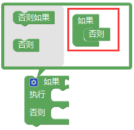

5.  代码逻辑是传感器感应到按键按下时，信号端为低电平，D3口为低电平，即item为

    0。这时我们在串口监视器显示对应的数字值和字符；否则（传感器感应到按键松开时），item为1，窗口监视器显示1和另外的字符。

测试结果

上传测试代码成功，利用USB线上电后，打开串口监视器，设置波特率为9600。串口监视器显示对应数据和字符。实验中，当传感器按下按键时，item为0，串口监视器显示“Press the button”字符；松开按键时，item为1，串口监视器显示“Loosen the button”字符，如下图。

## 实验十 电容触摸传感器检测实验

实验说明

在这个套件中，有一个keyes brick电容触摸传感器，它主要采用1个TTP223-BA6芯片。它是触摸检测芯片，提供一个触摸按键，功能是用可变面积的按键取代传统按键。当我们上电之后，传感器需要约0.5秒的稳定时间，此时间段内不要对键进行触摸，此时所有功能都被禁止，始终进行自校准，校准周期约为4秒。

实验中，我们通过读取传感器上S端高低电平，判断传感器上按键是否按下；并且，我们在串口监视器上显示测试结果。

实验器材

keyes brick电容触摸传感器*1

keyes UNO PLUS开发板*1

传感器扩展板*1

3P双头XH2.54连接线*1

USB线*1

接线图

测试代码

代码说明

1\. 在实验中，我们需要在库文件的单元内，找到以下元件。

2\.
其它设置方法和上一实验类似。在上一实验中，当检测到按键信号时，信号端为低电平，即item为0。在这一实验中，当检测到按键信号时，信号端为高电平，即item为1。

测试结果

上传测试代码成功，利用USB线上电后，打开串口监视器，设置波特率为9600。串口监视器显示对应数据和字符。实验中，当传感器按下按键时，item为1，串口监视器显示“Press the button”字符；松开按键时，item为0，串口监视器显示“Loosen the button”字符，如下图。

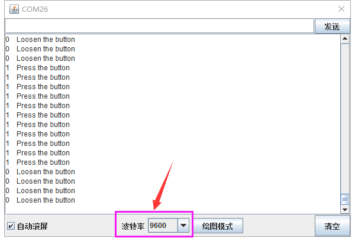

## 实验十一 干簧管检测附近磁场

实验说明

在这个套件中，有一个keyes brick 干簧管模块，它主要采用MKA10110
绿色磁簧元件元件。簧管是干式舌簧管的简称，是一种有触点的无源电子开关元件，具有结构简单，体积小便于控制等优点。它的外壳是一根密封的玻璃管，管中装有两个铁质的弹性簧片电板，还灌有一种惰性气体。平时，玻璃管中的两个由特殊材料制成的簧片是分开的。当有磁性物质靠近玻璃管时，在磁场磁力线的作用下，管内的两个簧片被磁化而互相吸引接触，簧片就会吸合在一起，使结点所接的电路连通。外磁力消失后，两个簧片由于本身的弹性而分开，线路也就断开了。该传感器就是利用元件这一特性，搭建电路将磁场信号转换为高低电平变换信号。

实验中，我们通过读取模块上S端高低电平，判断模块附近是否存在磁场；并且，我们在串口监视器上显示测试结果。

实验器材

keyes brick干簧管模块*1

keyes UNO PLUS开发板*1

传感器扩展板*1

3P双头XH2.54连接线*1

USB线*1

接线图

测试代码

代码说明

1\. 在实验中，我们需要在库文件的单元内，找到以下元件。

2\. 其它设置方法和实验九类似，这里就不多做介绍了。

测试结果

上传测试代码成功，利用USB线上电后，打开串口监视器，设置波特率为9600。串口监视器显示对应数据和字符。实验中，当传感器检测到磁场时，item为0，串口监视器显示“A magnetic field”字符；没有检测到磁场时，item为1，串口监视器显示“There is no magnetic field”字符，如下图。

## 实验十二 霍尔传感器检测磁场

实验说明

在这个套件中，有一个霍尔传感器，它主要采用A3144霍尔元件。该元件是由电压调整器、霍尔电压发生器、差分放大器、史密特触发器，温度补偿电路和集电极开路的输出级组成的磁敏传感电路，其输入为磁感应强度，输出是一个数字电压讯号。它是单极开关型的霍尔传感器，只感应南极磁场。传感器感应到无磁场或北极磁场时，信号端为高电平；感应到南极磁场时，信号端为低电平。当感应磁场强度越强时，感应距离越长。

实验中，我们利用霍尔传感器检测南极磁场，将测试结果在串口监视器上显示。

实验器材

keyes brick 霍尔传感器*1

keyes UNO PLUS开发板*1

传感器扩展板*1

3P 双头XH2.54连接线*1

USB线*1

接线图

测试代码

代码说明

1\. 在实验中，我们需要在库文件的单元内，找到以下元件。

2\. 其它设置方法和实验九类似，这里就不多做介绍了。

测试结果

上传测试代码成功，利用USB线上电后，打开串口监视器，设置波特率为9600。当传感器感应到南极磁场时，传感器监视器显示如图1；当传感器感应到无磁场或北极磁场时，串口监视器显示如图2。

图1

图2

## 实验十三 左右倾斜检测

实验说明

在这个套件中，有一个keyes brick 倾斜模块传感器，它主要采用SW-200D
振动开关元件。SW-200D
振动开关元件是滚珠型倾斜感应单方向性触发开关。该振动开关两端一端镀金，一端镀银；镀金端为触发端，镀银端为导电端。当传感器在水平位置或向导电端（镀银）倾斜时，开关元件为开路OFF状态，传感器信号端输出高电平；当传感器向触发端（镀金）倾斜时，开关元件为闭路ON状态，传感器信号端输出低电平。

实验中，我们通过读取模块上S端高低电平，判断传感器倾斜的方向；并且，我们在串口监视器上显示测试结果。

实验器材

keyes brick 倾斜模块传感器*1

keyes UNO PLUS开发板*1

传感器扩展板*1

3P双头XH2.54连接线*1

USB线*1

接线图

测试代码

代码说明

1\. 在实验中，我们需要在库文件的单元内，找到以下元件。

2\. 其它设置方法和实验九类似，这里就不多做介绍了。

测试结果

上传测试代码成功，利用USB线上电后，打开串口监视器，设置波特率为9600。串口监视器显示对应数据和字符。实验中，手握传感器白色接口，当传感器向右倾斜时，item为0，串口监视器显示“Right”字符；当传感器向左倾斜时，item为1，串口监视器显示“Left”字符，如下图。

## 实验十四 碰撞检测

实验说明

在这个套件中，有一个keyes brick
碰撞传感器，它主要采用1个轻触开关。当物体碰到轻触开关弹片，下压时，传感器信号端为低电平，自带D1 LED亮起；否则传感器信号端为高电平，自带D1 LED熄灭。该传感器常用于3D打印机内做限位开关。

实验中，我们通过读取模块上S端高低电平，判断传感器弹片是否下压；并且，我们在串口监视器上显示测试结果。

实验器材

keyes brick 碰撞传感器*1

keyes UNO PLUS开发板*1

传感器扩展板*1

3P双头XH2.54连接线*1

USB线*1

接线图

测试代码

代码说明

1\. 在实验中，我们需要在库文件的单元内，找到以下元件。

2\. 其它设置方法和实验九类似，这里就不多做介绍了。

测试结果

上传测试代码成功，利用USB线上电后，打开串口监视器，设置波特率为9600。串口监视器显示对应数据和字符。实验中，传感器上弹片下压时，item为0，串口监视器显示“The end of his!”字符；当松开弹片时，item为1，串口监视器显示“All going well!”字符，如下图。

## 实验十五 附近有人吗

实验说明

在这个套件中，有一个keyes brick
人体红外热释电传感器，它是一款基于热释电效应的人体热释运动传感器，能检测到人体或动物身上发出的红外线，配合菲涅尔透镜能使传感器探测范围更远更广。它主要采用RE200B-P传感器元件。

实验中，我们通过读取模块上S端高低电平，判断附近是否有人在运动；并且，我们在串口监视器上显示测试结果。

实验器材

keyes brick人体红外热释电传感器*1

keyes UNO PLUS开发板*1

传感器扩展板*1

3P双头XH2.54连接线*1

USB线*1

接线图

注：传感器自带2个电位器用于调节延迟时间和接收灵敏度，方法如下图。

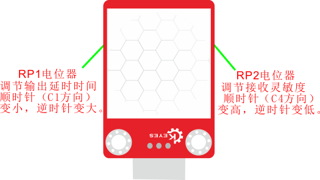

测试代码

代码说明

1\. 在实验中，我们需要在库文件的单元内，找到以下元件。

2\. 其它设置方法和实验九类似，这里就不多做介绍了。

测试结果

上传测试代码成功，利用USB线上电后，打开串口监视器，设置波特率为9600。

串口监视器显示对应数据和字符。实验中，传感器检测到附近有人在运动时，item为1，串口监视器显示“Somebody is in this area!”字符；没有检测到人运动时，item为0，串口监视器显示“No one!”字符，如下图。

## 实验十六 巡线传感器检测黑白线

实验说明

在这个套件中，有一个keyes brick 巡线传感器，它主要采用1个TCRT5000
反射型
黑白线识别传感器元件。传感器的原理是利用红外线对颜色的反射率不一样，将反射信号的强弱转化成电流信号。传感器没有检测到物体或者检测到黑色物体时，信号端为高电平；检测到白色物体时，信号端为低电平；它的检测高度为
0—3cm。我们可以通过旋转传感器上电位器，调节灵敏度，即调节检测高度。当旋转电位器，是传感器上D1 LED介于不亮与亮之间的临界点时，灵敏度最好。

实验中，我们通过读取模块上S端高低电平，判断传感器检测到的物体颜色（黑白）；并且，我们在串口监视器上显示测试结果。

实验器材

keyes brick巡线传感器*1

keyes UNO PLUS开发板*1

传感器扩展板*1

3P双头XH2.54连接线*1

USB线*1

接线图

测试代码

代码说明

1\. 在实验中，我们需要在库文件的单元内，找到以下元件。

2\. 其它设置方法和实验九类似，这里就不多做介绍了。

测试结果

上传测试代码成功，利用USB线上电后，打开串口监视器，设置波特率为9600。串口监视器显示对应数据和字符。实验中，当传感器没有检测到物体或者检测到黑色物体时，item为1，串口监视器显示“Black”字符；检测到白色物体（能够反光）时，item为0，串口监视器显示“White”字符，如下图。

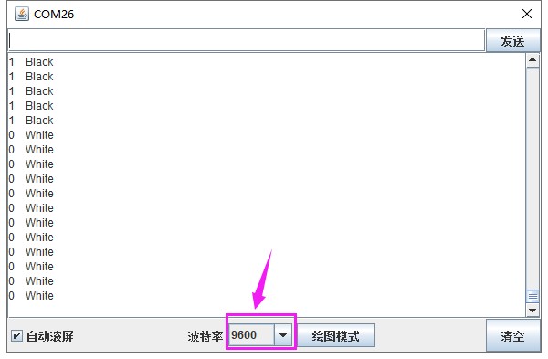

## 实验十七 避障传感器检测障碍物

实验说明

在这个套件中，有一个keyes brick避障传感器，它主要采用一对红外线发射与接收管元件。原理就是发射管发射出一定频率的红外线，当检测方向遇到障碍物（反射面）时，红外线反射回来被接收管接收，此时指示灯亮起，经过电路处理后，信号输出接口输出数字信号。传感器上有两个电位器，一个用于调节发送功率，一个用于调节接收频率，通过调节2个电位器，我们可以调节它的有效距离。

实验中，我们通过读取传感器上S端高低电平，判断是否存在障碍物；并且，我们在串口监视器上显示测试结果。

实验器材

keyes brick避障传感器*1

keyes UNO PLUS开发板*1

传感器扩展板*1

3P双头XH2.54连接线*1

USB线*1

接线图

测试代码

代码说明

1\. 在实验中，我们需要在库文件的单元内，找到以下元件。

2\. 其它设置方法和实验九类似，这里就不多做介绍了。

特别注意

烧录好测试代码，按照接线图连接好线，上电后，我们开始调节两个电位器调节感应距

离。

1.  调节发射功率调节电位器，先将电位器顺时针到尽头，然后回调一些，使传感器上

    D1 LED介于不亮与亮之间的零界点。

2.  调节接收频率调节电位器，顺时针调节时，频率增大。调节使它产生38KHz频率的方波，调节时，也观察传感器上D1     LED，使它介于不亮与亮之间的零界点。

测试结果

上传测试代码成功，利用USB线上电后，打开串口监视器，设置波特率为9600。串口监视器显示对应数据和字符。实验中，当传感器检测到障碍物时，item为0，串口监视器显示“There are obstacles”字符；没有检测到障碍物时，item为1，串口监视器显示“All going well”字符，如下图。

## 实验十八 魔术光杯传感器

实验说明

在这个套件中，有两个keyes brick魔术光杯传感器，它的原理是利用PWM调光的原理，两个传感器的亮度发生变化。滚珠开关提供数字信号，触发PWM的调节，通过程序的设计，我们就能看到类似于两组装满光的杯子倒来倒去的效果了。

实验中，我们通过读取传感器上S端高低电平，判断传感器的倾斜方向，然后控制传感器上LED的亮度变化（调节L端的PWM值）。

实验器材

keyes brick魔术光杯传感器\*2

keyes UNO PLUS开发板*1

传感器扩展板*1

4P双头XH2.54连接线\*2

USB线*1

接线图

测试代码

代码说明

1.下面是设置子程序，模拟PWM口的PWM值，设置子程序方法可以参考实验二。设置时，设置方波，设置高低电平延迟时间总共为1000微妙，即周期为1秒，频率是1000Hz。设置是PWM值就相当于设置方波时高电平的延迟时间（val1和val2）。

2.设置程序逻辑如下表格

条件
数字口A2（buttonStateA）为高电平并且brightnessA不是1000

设置
brightnessA设置为brightnessA加1（最大1000）

条件
数字口A2（buttonStateA）为低电平并且brightnessA不是0

设置
brightnessA设置为brightnessA减1（最小0）

条件
数字口A4（buttonStateB）为高电平并且brightnesB不是0

设置
brightnessB设置为brightnessB减1（最小0）

条件
数字口A4（buttonStateB）为低电平并且brightnessB不是1000

设置
brightnessB设置为brightnessB加1（最大1000）

条件
brightnessA为0

设置
设置数字口A3为低电平

条件
brightnessA为1000

设置
设置数字口A3为高电平

条件
brightnessA大于0且小于1000

设置
利用数字口A3模拟PWM口，设置A3的PWM值为brightnessA

条件
brightnessB为0

设置
设置数字口A5为低电平

条件
brightnessB为1000

设置
设置数字口A5为高电平

条件
brightnessB大于0且小于1000

设置
利用数字口A5模拟PWM口，设置A5的PWM值为brightnessB

测试结果

上传测试代码成功，利用USB线上电后，打开串口监视器，设置波特率为9600。将两个魔术光杯传感器同时倾斜一边，
一个魔术光杯上的LED逐渐变暗，同时另一个逐渐变亮，最终一个LED完全熄灭，一个LED最亮；在串口监视器中看到对应具体数值变化，如下图。当倾斜另一边中，现象一样，方向相反。

## 实验十九 光折断计数

实验说明

这个套件中包含一个 keyes brick
光折断传感器，它主要采用1个ITR-9608光电开关。它属于对射遮断式光电开关光学开关传感器。当用纸片挡住传感器凹槽后，传感器信号端为高电平，自带D1 LED熄灭；否则传感器信号端为低电平，自带D1 LED亮起。

在这里，我们通过检测传感器信号端高低电平，通过代码设置，模拟出流水线上利用类似传感器，对产品进行计数。

实验器材

keyes brick光折断传感器*1

keyes UNO PLUS开发板*1

传感器扩展板*1

3P双头XH2.54连接线*1

USB线*1

接线图

测试代码

代码说明

1\. 在实验中，我们需要在库文件的单元内，找到以下元件。

2.通过以下表格，我们可以了解这个代码的逻辑设置。

初始设置

PushCounter设置为0（累计通过物体数目）

State设置为0（传感信号端数值）

lastState设置为0（传感器信号端上一循环数值）

当物体开始穿过传感器凹槽时（一瞬间）
State检测到变为1，lastState为0，两个数据不相等。
PushCounter设置为PushCounter加1

当物体穿过传感器凹槽过程中（循环）
State检测到变为1，lastState设置为1，两个数据相等。
PushCounter不变

当物体刚穿过传感器凹槽过程中（一瞬间）
State检测到变为0，lastState设置为1，两个数据不相等。
PushCounter不变

当物体完全穿过传感器凹槽后（循环）
State检测到变为0，lastState设置为0，两个数据相等。
PushCounter不变

测试结果

上传测试代码成功，按照接线图接好线，利用USB上电后，打开串口监视器，设置波特率为9600；串口监视器显示PushCounter数据，每个物体穿过传感器凹槽，PushCounter数据不断加1。

## 实验二十 旋转编码器模块计数

实验说明

在这个套件中，有一个keyes brick
旋转编码器模块，它主要采用20脉冲旋转编码器元件。它可通过旋转计数正方向和反方向转动过程中输出脉冲的次数，这种转动计数是没有限制的，复位到初始状态，即从0开始计数。如果我们只计算信号的脉冲，则可以使用两个输出中的任何一个来确定旋转位置。但是，如果我们想要确定旋转方向，我们需要同时考虑两个信号。

实验中，我们利用keyes brick
旋转编码器模块用于计数，当我们顺时针旋转编码器时，设置数据i加1；逆时针旋转编码器时，设置数据i减1；按下编码器中间按键时，设置数据i为0；将测试结果在串口监视器上显示。

实验器材

keyes brick 旋转编码器模块*1

keyes UNO PLUS开发板*1

传感器扩展板*1

5P双头XH2.54连接线*1

USB线*1

接线图

测试代码

代码说明

1.  在实验中，我们需要在库文件的单元内，找到以下元件。

    

    2\.     我们把CLK设置为2、DAT设置为3。该代码在库文件中设置好了，它的意思是中断2（CLK）下降后，读取数字口3（DAT）电压，当DAT电压为高电平时，i加1；当DAT电压为低电平时，i减1。我们可以打开米思齐软件中的看到对应设置的C语言代码。

    3\. 然后循环程序中设置按钮管脚（D4）为低电平时，i设置为0。

    4\. 将i的数据在串口监视器中打印出来，设置串口打印时，必须在初始化中设置波特率。

测试结果

上传测试代码成功，利用USB线上电后，打开串口监视器，设置波特率为9600。顺时针旋转编码器，显示数据增加；逆时针旋转编码器，显示数据减小；按下编码器中间按键，显示数据为0，如下图。

## 实验二十一 敲击模块传感器检测状态

实验说明

在这个套件中，有一个敲击模块传感器，它主要采用SW-2802振动开关元件。SW-2802振动开关元件是弹簧型震动感应触发开关。该振动开关在静止時为开路OFF状态，
当受到外力碰触而达到相应震动力时,或移动速度达到适当离(偏)心力时，导电接脚会产生瞬间导通呈瞬间ON状态;当外力消失時,开关恢复为开路OFF状态。该传感器就是利用元件这一特性，搭建电路将震动信号转换为高低电平变换信号。

实验中，我们利用敲击模块传感器检测敲击状态，将测试结果在串口监视器上显示。

实验器材

keyes brick 敲击模块传感器*1

keyes UNO PLUS开发板*1

传感器扩展板*1

3P 双头XH2.54连接线*1

USB线*1

接线图

测试代码

代码说明

1.  在实验二中，我们教了怎么设置子程序。

2.  在这一实验中，我们主要接触到的新知识是中断知识。keyes UNO     R3开发板的中断

    口是数字口2和数字口3，我们把信号端设置在数值口3了。

3.  我们在 找到，设置管脚为3，

    有3中模式：上升、下降和改变。没有敲击时，传感器信号端为高电平，感受到敲击信号，传感器信号端变为低电平；因此我们设置为下降。

4.  中断设置为，就是说，传感器感应到敲击信号，中

    断口3下降，执行子程序，否则执行循环程序。

测试结果

上传测试代码成功，利用USB线上电后，打开串口监视器，设置波特率为9600。当传感器敲击信号时，传感器监视器显示“Knock on!”字符；否则显示“All going well!”字符，如下图。

## 实验二十二 超声波测距

实验说明

在这个套件中，有一个HC-SR04超声波传感器，它可以检测前方是否存在障碍物，并且检测出传感器与障碍物的详细距离。它的原理和蝙蝠飞行的原理一样，就是超声波模块发送出一种频率很高，人体无法听到的超声波信号。这些超声波的信号若是碰到障碍物，就会立刻反射回来，在接收到返回的信息之后，通过判断发射信号和接收信号的时间差，计算出传感器和障碍物的距离。

实验中，我们利用传感器检测传感器和障碍物之间的距离，将测试结果在串口监视器上显示。

实验器材

keyes brick HC-SR04超声波传感器*1

keyes UNO PLUS开发板*1

传感器扩展板*1

4P 双头XH2.54连接线*1

USB线*1

接线图

测试代码

代码说明

1.  我们在 找到。根据接线，将Trig设置为12，Echo设置为13。

2.  HC-SR04超声波传感器最大测试距离为3-4m，最小测试距离为2cm。设置代码当检测距离小于2cm或者大于等于400cm时，串口监视器显示-1。

    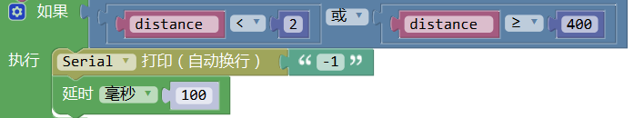

3.  我们在电脑的串口监视器中显示除传感器和障碍物之间的距离。

测试结果

上传测试代码成功，利用USB线上电后，打开串口监视器，设置波特率为9600。如果障碍物在测试范围外，串口监视器显示“-1”；否则，串口监视器显示超声波传感器和前方障碍物之间的距离，单位为cm，如下图。

## 实验二十三 红外发射

实验说明

在这个套件中，有一个
红外发射传感器，它主要用到了红外发射管。它是一个能发射出特定波长红外光的二极管。我们可以将传感器连接到单片机上，利用编程，控制传感器发射出38KHz
调制信号，可适应市面上各种红外接收头，以便红外线接收传感器能接收到，从而实现红外无线通讯。

实验中，我们利用红外发射传感器发射对应数据，每发射一次数据，传感器上的D1 LED就闪烁一次。

实验器材

keyes brick 红外发射传感器*1

keyes UNO PLUS开发板*1

传感器扩展板*1

3P 双头XH2.54连接线*1

USB线*1

接线图

测试代码

代码说明

1.  我们在 找到，库文件内部设置传感器信号端连接在D3接口。

2.  在里面填入需要发送的数据，该数据可以用16进制、10进制和2进制的输入方法，代码中用的是16进制方法，我们可以改为和
    ，效果一样。发射的数据最大为0xFF（255     B11111111）。

测试结果

按照接线图接线，上传测试代码成功，上电后，传感器红外发射管不断发射0xE7的数据，间隔时间为0.2秒。发射数据时，传感器上的D1 LED不断闪烁。

## 实验二十四 红外接收

实验说明

上一实验中，我们介绍红外发射传感器的使用方法。这一实验中，我们了解下红外接收传感器的使用方法。红外接收传感器主要采用VS1838B红外接收传感器元件。该元件是集接收、放大、解调一体的器件，内部IC就已经完成了解调，输出的就是数字信号。它可接收标准38KHz调制的遥控器信号。

实验中，我们利用红外接收传感器接收外部红外发射设备发射的红外信号，并将接收信号在串口监视器上显示。

实验器材

keyes brick 红外接收传感器*1

keyes UNO PLUS开发板*1

传感器扩展板*1

3P 双头XH2.54连接线*1

USB线*1

接线图

测试代码

代码说明

1.  我们在 找到，

    根据接线，我们把管脚设置为3。

2.  设置后，我们得到接收到的数据，默认为是10进制的。为了方便读取数据，我们可

    以在找到，将所得数据转换为你需要的进制的数据，代码中转换为16进制数据。

测试结果

按照接线图接线，上传测试代码成功，利用USB线上电后，打开串口监视器，里面就会显示红外接收传感器接收到的数据。

按照上一个试验的方法，制作一个红外发射设备（发射0xE7数据），按照这一实验方法制作红外接收设备。红外发射传感器的发射头，对准红外接收传感器的接收头。接收到信号后，红外接收传感器上的D1也开始闪烁，串口监视器显示如下图。

我们也可以将红外遥控当做红外发射设备，将红外遥控对准红外接收传感器的接收头，串口监视器显示如下图。

## 实验二十五 DS18B20温度传感器测试温度

实验说明

在这个套件中，有一个keyes brick 18B20温度传感器，它主要采用DS18B20传感器元件。我们可以利用该传感器测试当前环境中的温度。它的测量范围为－55℃～＋125℃，测量精度为±0.5℃（-10℃至+85℃范围内）。

实验中，我们利用这个温度传感器测试当前环境中的温度，测试结果分为℃和℉两种；并且，我们在串口监视器上显示测试结果。

实验器材

keyes brick 18B20温度传感器*1

keyes UNO PLUS开发板*1

传感器扩展板*1

3P双头XH2.54连接线*1

USB线*1

接线图

测试代码

代码说明

1\. 在实验中，我们需要在库文件的单元内，找到以下元件。

2\. 我们把管脚设置为3，获取温度的单位分别设置为℃和℉。

3\. 设置两个小数变量，分别为val1和val2，将所测结果赋值给val1和val2。

4\.
串口监视器显示val1和val2的值，显示前需设置波特率（我们默认设置为9600，可更改）。

5\.
显示时，我们在数据后面添加单位，如果单位直接设置为℃和℉，测试结果会出现乱码。所以我们直接用C代替℃，F代替℉。

测试结果

上传测试代码成功，利用USB线上电后，打开串口监视器，设置波特率为9600。串口监视器显示当前环境的温度，如下图。

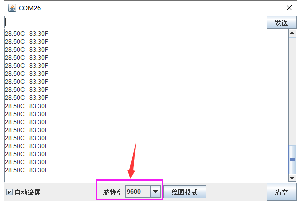

## 实验二十六 DHT11温湿度传感器检测温湿度

实验说明

在这个套件中，有一个keyes brick DHT11温湿度传感器，它主要采用DHT11
温湿度传感器元件。它是一款含有已校准数字信号输出的温湿度复合传感器。它应用专用的数字模块采集技术和温湿度传感技术，确保产品具有极高的可靠性与卓越的长期稳定性。传感器包括一个电阻式感湿元件和一个NTC测温元件，并与一个高性能8位单片机相连接。因此该产品具有品质卓越、超快响应、抗干扰能力强、性价比极高等优点。

实验中，我们利用这个传感器测试当前环境中的温湿度，并且，我们在串口监视器上显示测试结果。

实验器材

keyes brick DHT11温湿度传感器*1

keyes UNO PLUS开发板*1

传感器扩展板*1

3P双头XH2.54连接线*1

USB线*1

接线图

测试代码

代码说明

1\. 在实验中，我们需要在库文件的单元内，找到以下元件。

2\. 我们把管脚设置为3，选择获取温度和获取湿度。

3\. 设置两个小数变量，分别为val1和val2，将所测结果赋值给val1和val2。

4\.
串口监视器显示val1和val2的值，显示前需设置波特率（我们默认设置为9600，可更改）。

5\.
显示时，我们在数据后面添加单位。如果温度单位直接设置为℃，测试结果会出现乱码，所以我们直接用C代替℃；湿度单位直接设置为%。

测试结果

上传测试代码成功，利用USB线上电后，打开串口监视器，设置波特率为9600。串口监视器显示当前环境中的温湿度数据，如下图。

## 实验二十七 可调电位器模块读取模拟值

实验说明

在这个套件中，有一个keyes brick 可调电位器模块，它主要采用一个10K
可调电阻。通过旋转电位器，我们可以改变电阻大小，然后搭建电路将电阻变化转换为电压变化。

实验中，我们利用这个模块测试对应的模拟值；并且，我们在串口监视器上显示测试结果。

实验器材

keyes brick 可调电位器模块*1

keyes UNO PLUS开发板*1

传感器扩展板*1

3P双头XH2.54连接线*1

USB线*1

接线图

测试代码

代码说明

1\. 在实验中，我们需要在库文件的单元内，找到以下元件。

2\. 我们把管脚设置为A3。

3\. 设置1个整数变量item，将所测结果赋值给item。

4\.
串口监视器显示item的值，显示前需设置波特率（我们默认设置为9600，可更改）。

测试结果

上传测试代码成功，利用USB线上电后，打开串口监视器，设置波特率为9600。串口监视器显示对应模拟值。实验中，顺时针旋转电位器，模拟值增大，逆时针旋转电位器，模拟值减小，范围为0-1023，如下图。

## 实验二十八 光敏电阻传感器测试光照强度

实验说明

在这个套件中，有一个keyes brick
光敏电阻传感器，它是一个常用的光敏电阻传感器，它主要采用光敏电阻元件。该电阻元件电阻大小随着光照强度的变化而变化，当环境中有亮光的时候，电阻大小为5-10KΩ；没有亮光时，电阻大小为0.2MΩ。该传感器就是利用光敏电阻元件这一特性，搭建电路将电阻变化转换为电压变化。

实验中，我们利用这个传感器测试当前环境中的光照强度对应的模拟值，光照越强，模拟值越大；并且，我们在串口监视器上显示测试结果。

实验器材

keyes brick 光敏电阻传感器*1

keyes UNO R3开发板*1

传感器扩展板*1

3P双头XH2.54连接线*1

USB线*1

接线图

测试代码

代码说明

1\. 在实验中，我们需要在库文件的单元内，找到以下元件。

2\. 其它设置方法和实验二十七类似，这里就不多做介绍了。

测试结果

上传测试代码成功，利用USB线上电后，打开串口监视器，设置波特率为9600。串口监视器显示对应模拟值。实验中，我们把传感器用手握住，逐渐松开，光照逐渐变强，可以逐渐看到模拟值数据变大，如下图。

## 实验二十九 TEMT6000光线传感器

实验说明

在这个套件中，有一个keyes brick TEMT6000光线传感器，它主要采用TEMT6000X01元件。该元件是一个高灵敏可见光光敏（NPN型）三极管。传感器可以将捕获的微小光线变化并放大100倍左右，并且轻松的被微控制器识别，进行AD转换。它对可见光照度的反应特性与人眼的特性类似，可以模拟人对环境光线的强度的判断，从而方便做出与人友好互动的应用。

实验中，我们利用这个传感器测试当前环境中的光照强度对应的模拟值，光照越强，模拟值越大；并且，我们在串口监视器上显示测试结果。

实验器材

keyes brick TEMT6000光线传感器*1

keyes UNO PLUS开发板*1

传感器扩展板*1

3P双头XH2.54连接线*1

USB线*1

接线图

测试代码

代码说明

1\. 在实验中，我们需要在库文件的单元内，找到以下元件。

2\. 其它设置方法和实验二十七类似，这里就不多做介绍了。

测试结果

烧录好测试代码，按照接线图连接好线，利用USB线上电后，打开软件串口监视器，设置波特率为9600，我们可以看到对应光照强度的模拟值，光照越强，模拟值越大，如下图。

## 实验三十 热敏电阻传感器简单测试

实验说明

在这个套件中，有一个热敏电阻传感器，它主要采用NTC-MF52AT热敏电阻元件。NTC-MF52AT热敏电阻元件能够时感知周边环境温度的变化，电阻大小随着温度的变化而变化。该传感器就是利用NTC-MF52AT热敏电阻元件这一特性，搭建电路将电阻变化转换为电压变化。

实验中，我们将传感器信号端接到keyes UNO R3开发板模拟口，读出对应的模拟值。我们可以利用模拟值，通过特定公式，计算出当前环境的温度。由于温度计算公式比较复杂，这里就不多介绍了。实验中，我们只是读取对应的模拟值。

实验器材

keyes brick 热敏电阻传感器*1

keyes UNO PLUS开发板*1

传感器扩展板*1

3P 双头XH2.54连接线*1

USB线*1

接线图

测试代码

代码说明

1\. 在实验中，我们需要在库文件的单元内，找到以下元件。

2\. 其它设置方法和实验二十七类似，这里就不多做介绍了。

测试结果

上传测试代码成功，利用USB线上电后，打开串口监视器，设置波特率为9600。串口监视器显示对应的模拟值，温度越高，模拟值越大。

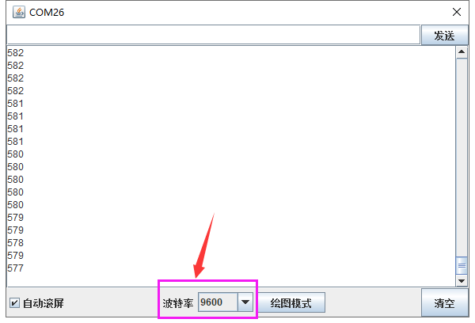

## 实验三十一 LM35温度传感器测试环境温度

实验说明

在这个套件中，有一个keyes brick LM35温度传感器，它主要采用LM35DZ传感器元件。该元件的输出电压与摄氏温标呈线性关系，转换公式如式，0时输出为0V，每升高1℃，输出电压增加10mV。

实验中，我们利用这个传感器测试当前环境中温度的大小；并且，我们在串口监视器上显示测试结果。

实验器材

keyes brick LM35温度传感器*1

keyes UNO PLUS开发板*1

传感器扩展板*1

3P双头XH2.54连接线*1

USB线*1

接线图

测试代码

代码说明

1\. 在实验中，我们需要在库文件的单元内，找到以下元件。

2\. 我们把管脚设置为A3。

3\.
设置1个小数变量val，将所测结果赋值给val。这val就是当前环境中的温度，在库文件中，已经添加了计算公式。

4\.
串口监视器显示测试的温度值，显示前需设置波特率（我们默认设置为9600，可更改）。

测试结果

上传测试代码成功，利用USB线上电后，打开串口监视器，设置波特率为9600。串口监视器显示当前环境中的温度数值，如下图。

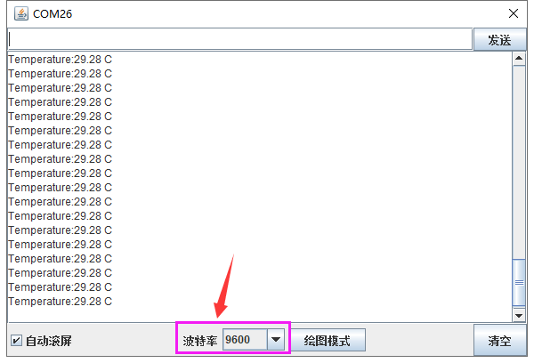

## 实验三十二 麦克风声音传感器检测声音大小

实验说明

在这个套件中，有一个keyes brick
麦克风声音传感器，它主要采用一个高感度麦克风元件和LM386芯片。高感度麦克风元件用于检测外界的声音。利用LM386芯片搭建合适的电路，我们对高感度麦克风检测到的声音进行放大，最大倍数为200倍。使用时我们可以通过旋转传感器上电位器，调节声音的放大倍数。调节时，顺时针调节电位器到尽头，放大倍数最大。

实验中，我们利用这个传感器测试当前环境中的声音大小对应的模拟值，声音越大，模拟值越大；并且，我们在串口监视器上显示测试结果。

实验器材

keyes brick 麦克风声音传感器*1

keyes UNO PLUS开发板*1

传感器扩展板*1

3P双头XH2.54连接线*1

USB线*1

接线图

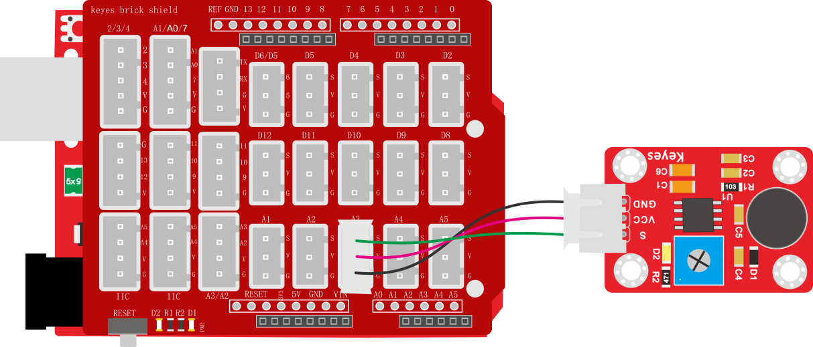

测试代码

代码说明

1\. 在实验中，我们需要在库文件的单元内，找到以下元件。

2\. 其它设置方法和实验二十七类似，这里就不多做介绍了。

测试结果

上传测试代码成功，利用USB线上电后，打开串口监视器，设置波特率为9600。串口监视器显示对应模拟值。实验中，我们顺时针旋转电位器和对准MIC头大声说话，可以看到模拟值数据变大，如下图。

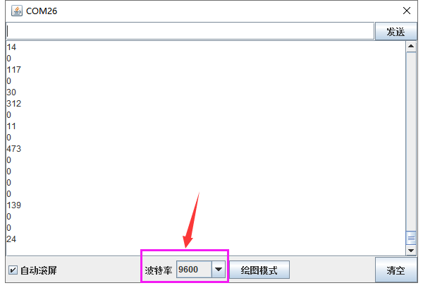

## 实验三十三 MQ-2 烟雾传感器

实验说明

在这个套件中，有一个keyes brick MQ-2 烟雾传感器，它主要用到了MQ-2
可燃气体、烟雾传感器元件。该元件所使用的气敏材料是在清洁空气中电导率较低的二氧化锡(SnO2)。当传感器所处环境中存在可燃气体时，传感器的电导率随空气中可燃气体浓度的增加而增大。该传感器对液化气、丙烷、氢气的灵敏度高，对天然气和其它可燃蒸汽的检测也很理想。它可检测多种可燃性气体，是一款适合多种应用的低成本传感器。

使用时，A0端读取对应气体的模拟值；D0端连接一个LM393芯片（比较器），我们可以通过电位器调节测量气体报警临界点，在D0输出数字值。当测量气体含量超过临界点时，D0端输出低电平；测量气体含量没超过临界点时，D0端输出高电平。

实验中，我们读取传感器A0端模拟值，和D0端数字值，判断空气中测量气体的含量，以及它们是否超标。

实验器材

keyes brick mq-2烟雾传感器*1

keyes UNO PLUS开发板*1

传感器扩展板*1

4P双头XH2.54连接线*1

USB线*1

接线图

测试代码

代码说明

1.  在实验中，我们需要在库文件的单元和单元内，

    找到以下元件。

    
    

    2\. 我们把管脚设置为A2，管脚设置为A3。

    3\. 参考实验九，根据A2管脚高低电平，设置串口监视器输出不同字符。

    4\.     根据接线，读取模拟口A3的模拟值，并将测试结果只是串口监视器上显示。

测试结果

上传测试代码成功，利用USB线上电后，打开串口监视器，设置波特率为9600。串口监视器显示对应数据和字符。实验中，我们可以看到当测试的模拟值小于等于255时，气体含量没有超过临界点；当测试的模拟值大于等于261时，气体含量超过临界点；那么就代表气体含量临界点对于的模拟值在255-261之间，我们可以通过旋转传感器上电位器，调节临界点。

## 实验三十四 MQ-3 酒精传感器

实验说明

在这个套件中，有一个keyes brick MQ-3 酒精传感器，它主要用到了MQ-3
酒精、乙醇蒸汽传感器元件。该元件所使用的气敏材料是在清洁空气中电导率较低的二氧化锡(SnO2)。当传感器所处环境中存在酒精蒸汽时，传感器的电导率随空气
中酒精蒸汽浓度的增加而增大。

使用时，A0端读取对应酒精蒸汽的模拟值；D0端连接一个LM393芯片（比较器），我们可以通过电位器调节测量酒精蒸汽报警临界点，在D0输出数字值。当测量酒精蒸汽含量超过临界点时，D0端输出低电平；测量酒精蒸汽含量没超过临界点时，D0端输出高电平。

实验中，我们读取传感器A0端模拟值，和D0端数字值，判断空气中酒精蒸汽的含量，以及它们是否超标。

实验器材

keyes brick MQ-3 酒精传感器*1

keyes UNO PLUS开发板*1

传感器扩展板*1

4P双头XH2.54连接线*1

USB线*1

接线图

测试代码

代码说明

1.  我们需要在库文件的单元和单元内，

    找到以下元件。

    
    

    2\. 其它设置方法和实验三十三类似，这里就不多做介绍了。

测试结果

上传测试代码成功，利用USB线上电后，打开串口监视器，设置波特率为9600。串口监视器显示对应数据和字符。实验中，我们可以看到当测试的模拟值小于等于286时，酒精蒸汽含量没有超过临界点；当测试的模拟值大于等于301时，酒精蒸汽含量超过临界点；那么就代表酒精蒸汽含量临界点对于的模拟值在286-301之间，我们可以通过旋转传感器上电位器，调节临界点。

## 实验三十五 摇杆模块传感器

实验说明

在这个套件中，有一个keyes brick 摇杆模块传感器，它主要采用PS2
手柄摇杆元件。控制时，我们需要将模块X Y端口连接单片机模拟口，B端口连接单片机数字口，VCC接单片机电源输出端（3.3-5V），GND接单片机GND。我们可以读取两个模拟值和一个数字口的高低电平情况，判断模块上摇杆的工作状态。

实验中，我们将读取两个模拟值和一个数字值，并在串口监视器上显示测试结果。

实验器材

keyes brick 摇杆模块传感器*1

keyes UNO PLUS开发板*1

传感器扩展板*1

5P双头XH2.54连接线*1

USB线*1

接线图

测试代码

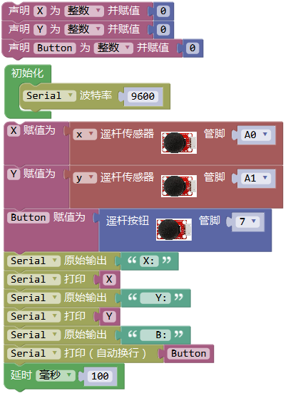

代码说明

1\. 在实验中，我们需要在库文件的单元内，找到以下元件。

2\. 根据接线，x管脚设置为A0，y管脚设置为A1，摇杆按钮管脚设置为7

3
串口监视器显示测试数据，显示前需设置波特率（我们默认设置为9600，可更改）。

测试结果

上传测试代码成功，利用USB线上电后，打开串口监视器，设置波特率为9600。串口监视器显示对应数值。摇动摇杆，x轴和y轴对应的模拟值发生改变，按下按钮，读取到的数字值为1，否则为0，如下图。

## 实验三十六 手指测心跳模块

实验说明

在这个套件中，有一个手指测心跳模块，它主要由1个光敏接收器和1个红外发射器组成。红外发射器在手指的一面，光敏接收器在手指的另一面；光敏接收器用来获取发射的光通量；当血压脉动通过手指时，光敏接收器的电阻会用微小的变化。

使用时，我们提供该模块和arduino系列单片机搭配使用的方法。**测试时，特别需要注意，需要用黑布包裹模块和手指，确保在无光环境中测试，否则测试不准确。**

实验中，我们将测试得到是数据，复制到Excel上，并生成相应的图片。

实验器材

keyes brick 手指测心跳模块*1

keyes UNO PLUS开发板*1

传感器扩展板*1

3P 双头XH2.54连接线*1

USB线*1

接线图

测试代码

代码说明

1\. 在实验中，我们需要在库文件的单元内，找到以下元件。

2.将管脚设置为A3，将所测数据用串口监视器打印出来。

测试结果

烧录好测试代码，按照接线图连接好线；利用USB接口上电后，进入串口监视器，设置波特率为9600。用，用手指按住光敏接收器，用黑布包裹模块和手指。串口监视器显示对应数据，如下图。

等待一会，将串口监视器数据复制到excel上，生成对应图片，如下图。

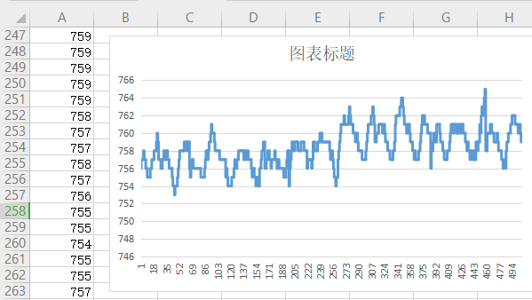

## 实验三十七 ADXL345加速度传感器

实验说明

在这个套件中，有一个keyes brick ADXL345加速度传感器，它采用ADXL345BCCZ芯片。ADXL345BCCZ是一款小而薄的低功耗3轴加速度计，分辨率高（13位），测量范围达±16g。它数字输出数据为16位二进制补码格式，可通过SPI（3线或4线）或I2C数字接口访问。该传感器非常适合移动设备应用。它可以在倾斜检测应用中测量静态重力加速度，还可以测量运动或冲击导致的动态加速度。其高分辨率(4mg/LSB)，能够测量不到1.0°的倾斜角度变化。

实验中，我们测试出传感器X Y Z轴的加速度数值；并且，我们在串口监视器上显示测试数据。

实验器材

keyes brick ADXL345加速度传感器*1

keyes UNO PLUS开发板*1

传感器扩展板*1

4P双头XH2.54连接线*1

USB线*1

接线图

测试代码

代码说明

1\. 在实验中，我们需要在库文件的单元内，找到以下元件。

2\. 设置3个小数变量X Y Z，将所测结果赋值给X Y Z。

3\. 串口监视器显示X Y Z的值，显示前需设置波特率（我们默认设置为9600，可更改）。

测试结果

上传测试代码成功，利用USB线上电后，打开串口监视器，设置波特率为9600。串口监视器显示传感器对应的X Y Z的值，单位为g，如下图。

# 模块组合实验课程

前面课程中，我们单独测试了传感器/模块的功能，功能比较单一。在此，我们可以将多个传感器/模块搭配使用，组合出各种各样的功能。传感器/模块种类比较多，我们只是选择几款比较经典的组合实验。你们也可以根据自己的想法，自己设置代码，组合出你想要的特别的功能。

## 实验一 电位器调节灯光亮度

实验说明

在前面课程中，我们学习了利用代码调节LED模块上LED亮度的方法。学习利用可调电位器读取模拟值的方法。两个组合，我们利用可调电位器读取到的模拟值控制LED的亮度。设计代码时，模拟值的范围是0-1023；LED的亮度是由PWM值控制，范围为0-255。在这里，我们就需要用到映射功能，将0-1023数值映射到0-255。

设置成功后，我们就可以通过旋转电位器，控制模块上LED的亮度。

实验器材

keyes brick LED模块*1

keyes brick 可调电位器模块*1

keyes UNO PLUS开发板*1

传感器扩展板*1

3P 双头XH2.54连接线\*2

USB线*1

接线图

测试代码

代码说明

实验中，主要新增的知识点就是映射功能

将val1从范围0-1023映射到0-255，并赋值给val2。

测试结果

上传测试代码成功，上电后，旋转模块上电位器，就可以调节LED模块上的LED的亮度。

## 实验二 模拟户外灯

实验说明

在生活中我们可以看到户外有很多公共灯光。这些灯白天不亮，一到晚上，阳光暗下的时候，自动亮起；当阳光变亮时，这些灯就自动关闭。难道是有人在手动控制这些灯光？实际上不是的，实际上这些灯光上都安装有光敏传感器，这些传感器将外界阳光的亮暗，转换成对应数值。然后设置一个临界点，当超过临界点时，控制灯光熄灭，没有超过时，控制灯光亮起。

在这个实验中，我们利用套件中自带的光敏电阻传感器和LED模块模拟这一现象。

实验器材

keyes brick 光敏电阻传感器*1

keyes brick LED模块*1

keyes UNO PLUS开发板*1

传感器扩展板*1

3P 双头XH2.54连接线\*2

USB线*1

接线图

测试代码

代码说明

1\. 在实验中，我们需要在库文件的单元内，找到以下元件。

2\.
设置变量，控制设置，以及串口通信，我们都在前面课程中介绍了。可以参考第四章节的实验九。

测试结果

上传测试代码成功，利用USB线上电后，打开串口监视器，设置波特率为9600。串口监视器显示对应模拟值。实验中，我们把光敏电阻传感器用手握住，数据变小，小于600时，LED模块上LED亮起，否则熄灭。

## 实验三 旋转编码器模块控制双色LED模块

实验说明

在前面课程的实验二十中，我们利用旋转编码器计数。在这里我们将它扩展下，通过得出的计数，我们用来控制双色LED模块上LED显示不同颜色。

设计代码时，我们需要对所得数据取绝对值。然后我们将数据除以二，得到余数，余数为0控制双色LED模块上LED亮红光，余数为1，双色LED模块上LED亮绿光。

实验器材

keyes brick 旋转编码器模块*1

keyes UNO PLUS开发板*1

keyes brick 双色LED模块*1

传感器扩展板*1

5P双头XH2.54连接线*1

3P 双头XH2.54连接线*1

USB线*1

接线图

测试代码

代码说明

1.  在实验中，我们我们在找到，然后改为，

    即可设计对i取绝对值。

2.  在实验中我们我们在找到
    ，将+改成%，设置

    ，即将val1设置为val除以2的余数。

3.  得到余数后，我们可以在找到

    ，设置管脚，根据接线设置管脚为5（绿灯）和6（红灯）。

4.  参考前面实验学习的控制方法，利用余数控制模块上LED显示对应灯光颜色。也可

    以参考第四章实验二方法，通过设置子程序，设置PWM值，调节模块上LED的颜色（多种）。

测试结果

上传测试代码成功，按照接线图接好线，上电后，旋转编码器，即可控制外接的双色LED模块上的LED的颜色（红与绿）。

## 实验四 按键控制RGB灯

实验说明

在前面课程中，我们利用旋转编码器计数然后控制双色LED模块。在这一课程中，我们做一个扩展，我们利用代码，计算出按下模块上按键的次数。设置计数代码时，我们可以参考第四章实验十九的计数代码。然后我们将所得数据除以三，所得余数为0 1 2三种。然后通过不同的余数，控制RGB模块上LED显示不同的颜色。

这样，我们就可以通过不断的按下按键，任意调节RGB模块上LED显示不同颜色了（三种颜色）。

实验器材

keyes brick 插件RGB模块*1

keyes UNO PLUS开发板*1

keyes brick 按键传感器*1

传感器扩展板*1

4P双头XH2.54连接线*1

3P 双头XH2.54连接线*1

USB线*1

接线图

测试代码

代码说明

1.  在实验中，我们需要在库文件的和单

    元内，找到以下元件。

    

    

    2.通过以下表格，我们可以了解这个代码的逻辑设置。

初始设置

PushCounter设置为0（累计通过物体数目）

PushCounter1设置为0（累计通过物体数目除以3的余数）

State设置为1（传感信号端数值）

lastState设置为1（传感器信号端上一循环数值）

按键按下（一瞬间）
State检测到变为0，lastState为1，两个数据不相等。
PushCounter设置为PushCounter加1
PushCounter1加1或变为0

长按按键（循环）
State检测到变为0，lastState设置为0，两个数据相等。
PushCounter不变
PushCounte1不变

松开按键（一瞬间）
State检测到变为1，lastState设置为0，两个数据不相等。
PushCounter不变
PushCounte1不变

按键松开（循环）
State检测到变为1，lastState设置为1，两个数据相等。
PushCounter不变
PushCounte1不变

PushCounte1为0

设置RGB模块上LED显示红色

PushCounte1为1

设置RGB模块上LED显示绿色

PushCounte1为2

设置RGB模块上LED显示蓝色

测试结果

上传测试代码成功，按照接线图接好线，利用USB上电后，打开串口监视器，设置波特率为9600；串口监视器显示数据，不断按下按键，数据在0 1
2中变化。当为0时，RGB模块上LED显示红色；当为1时，RGB模块上LED显示绿色；当为2时，RGB模块上LED显示蓝色。

## 实验五 温度控制RGB灯

实验说明

在前面实验中，我们利用按键手动控制RGB模块上LED灯的颜色。在这一课程中，我们利用一个LM35温度传感器检测当前环境的温度。然后利用检测到的温度数据控制RGB模块上LED灯的颜色。

生活中，我们可以把这个电路设计应用到水杯中。我们利用温度传感器检测到水杯温度，控制水杯上LED的颜色。这样我们就可以通过LED颜色，判断水的大概温度。

实验器材

keyes brick 插件RGB模块*1

keyes UNO PLUS开发板*1

keyes brick LM35温度传感器*1

传感器扩展板*1

4P双头XH2.54连接线*1

3P 双头XH2.54连接线*1

USB线*1

接线图

测试代码

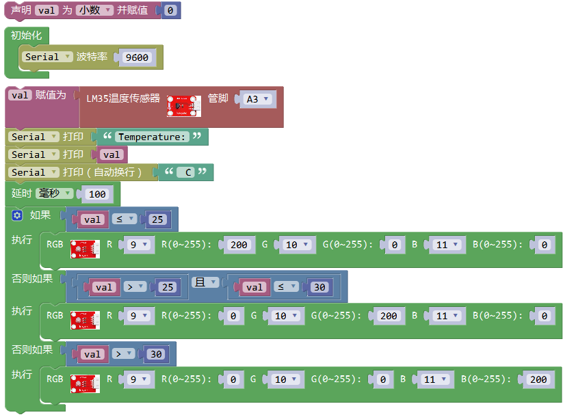

代码说明

1.实验中，检测并显示温度的方法和上一课中实验三十一一样。

2.检测到温度数据后通过设置控制RGB模块上的LED颜色，设置方法参考上一课中实验九知识点。

测试结果

上传测试代码成功，按照接线图接好线，利用USB上电后，打开串口监视器，设置波特率为9600；串口监视器显示当前环境中温度数值。当温度小于等于25℃时，RGB模块上的LED显示红色；当温度大于25℃且小于等于30℃时，RGB模块上的LED显示绿色；当温度大于30℃时，RGB模块上的LED显示蓝色。

## 实验六 障碍物报警实验

实验说明

在上一课实验十七中，我们利用避障传感器检测前方障碍物，结果在串口监视器显示。在这一实验中，我们利用检测结果控制一个有源蜂鸣器响起。

生活中，我们可以利用一个检测传感器控制一个有源蜂鸣器响起，做报警设备，如检测磁场（霍尔传感器）、检测倾斜（倾斜模块）等等。

实验器材

keyes brick 避障传感器*1

keyes UNO PLUS开发板*1

keyes brick 有源蜂鸣器模块*1

传感器扩展板*1

3P 双头XH2.54连接线\*2

USB线*1

接线图

测试代码

代码说明

1.实验中代码设置和上一课中实验九类似，只是将控制串口监视器显示换成了控制有源蜂鸣器的响起。

测试结果

上传测试代码成功，按照接线图接好线，上电后，检测到障碍物时，外接的有源蜂鸣器响起声音，否则有源蜂鸣器停止响起声音。

## 实验七 超声波模块模拟钢琴

实验说明

在前面一章节中，实验八，我们学会了利用无源蜂鸣器模块，调节响起声音的频率；实验二十二，我们学会了利用超声波传感器检测前方障碍物的距离。我们可以将两个实验结合在一起。设置时，我们通过超声波传感器测试出障碍物距离。然后，我们利用距离大小控制无源蜂鸣器上模块上蜂鸣器响起对应频率的声音。搭建好电路后，我们可以人为控制超声波前方障碍物，控制检测距离，从而达到控制声音响起频率，模拟钢琴演奏。

实验器材

keyes brick HC-SR04超声波传感器*1

keyes brick 无源蜂鸣器模块*1

keyes UNO PLUS开发板*1

传感器扩展板*1

3P 双头XH2.54连接线\*2

USB线*1

接线图

测试代码

代码说明

1.设置时，我们通过调节不同距离范围，设置声音频率，具体声音频率我们可以点击米思齐软件的处看到。

2.为方便控制障碍物距离，我们可以在上面代码中，根据实际情况，在控制逻辑里调节距离范围。

测试结果

上传测试代码成功，按照接线图接好线，上电后，检测到障碍物不同距离时，外接无源蜂鸣器模块上蜂鸣器响起不同频率的声音。

## 实验八 多个实验组合

实验说明

在前面我们做了很多实验，每做一个实验，我们都需要重新上传一次代码。那我们可以把多个实验组合在一起吗？可以的，在这一实验中，我们将第四章节中的实验三、实验二十四、实验二十六、实验三十五、实验三十七和本章节中的实验一，组合在一起。设置时，我们参考本章节实验四的方法，利用外接按键模块。每按一次按键，功能变换一次，实验功能循环交替。

实验器材

keyes brick LED白发白模块*1

keyes brick 按键传感器*1

keyes brick DHT11温湿度传感器*1

keyes brick ADXL345加速度传感器*1

keyes brick 红外接收传感器*1

keyes brick 摇杆模块传感器*1

keyes brick 可调电位器模块*1

keyes brick 插件RGB模块*1

keyes UNO PLUS开发板*1

传感器扩展板*1

3P 双头XH2.54连接线\*5

4P 双头XH2.54连接线\*2

5P 双头XH2.54连接线*1

USB线*1

接线图

测试代码

代码说明

1.设置时，我们参考本章节实验四方法。计算出按下按键的次数，除以6，得到余数，为0 1 2 3 4 5，根据不同的余数，控制实验实现不同功能。

2.实验中，我们对应功能，都利用了子程序设置。子程序设置方法，可以参考上一章节实验二。

3.参照介绍方法，我们可以在接线中添加或减少传感器/模块，然后在代码中更改实验功能。

测试结果

上传测试代码成功，按照接线图接好线，利用USB上电。

刚开始时，按键次数为0，余数为0，RGB模块上LED循环闪烁红绿蓝三种颜色。

点击打卡串口监视器，设置波特率为9600，按一下按键（时间长些），按键次数为1，余数为1，RGB模块上LED显示蓝色，实验实现的功能是红外接收模块红外发射信息。如果我们利用红外遥控对准接收模块接收头，按下按键，红外接收头接收到信息，串口监视器显示如下。

特别注意：如果先按下按键，按键次数变为1，再打开串口监视器时，程序会复位，

按键成次数会变为0，需要再按下按键重新设置按键次数。

再按一下按键，按键次数为2，余数为2，实验实现的功能是利用DHT11温湿度传

感器读取环境中的温湿度数值，每0.1秒读取一次，串口监视器显示数据如下图。

再按一下按键，按键次数为3，余数为3，实验实现的功能是读取摇杆模块传感器X轴和Y轴对应的模拟值，B（Z轴）接口对应的数字值，串口监视器显示如下图。

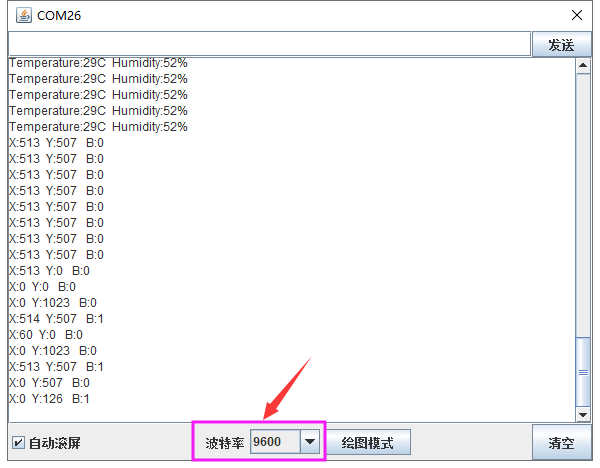

再按一下按键，按键次数为4，余数为4，实验实现的功能是利用ADXL345加速度传感器测试X Y Z 3轴加速度数值，单位为g，串口监视器显示如下图。

再按一下按键，按键次数为5，余数为5，实验实现的功能是利用外接可调电位器模块调节D5接口的PWM值，从而调节外接的LED白发白模块上LED的亮度。串口监视器显示图下图。

再按一下按键，按键次数为6，余数为0，实现初始时的现象。不断按下按键，余数循环变化，实验功能也循环变化。

# 相关资料链接地址

XXXXXXXXXXXXXXXXXXXXXXXXXXXXXXXXXXXXX

提取码：XXXX

米思齐软件下载地址

<http://mixly.org/explore/software/mixly-arduino>
